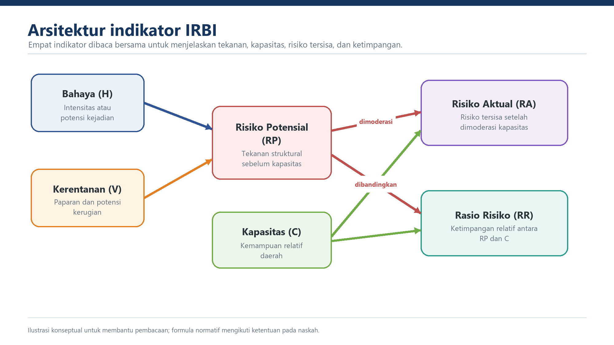

::: {.status-strip}
**Status:** draf kerja, belum normatif &nbsp;·&nbsp; **Acuan:** laporan 2026, workbook, dan register isu &nbsp;·&nbsp; **Versi:** 0.8
:::

## Tujuan Bab

Menjelaskan pemisahan Risiko Potensial, Kapasitas, Risiko Aktual, dan Rasio Risiko sebagai inti reformulasi serta batas penggunaannya dalam kebijakan.

## 2.1 Konsep Risiko Bencana

Risiko bencana dipahami sebagai hasil interaksi bahaya, kerentanan, dan kapasitas. Bahaya menggambarkan potensi kejadian yang dapat menimbulkan kerugian. Kerentanan menggambarkan kondisi penduduk, aset, kegiatan ekonomi, dan lingkungan yang dapat terdampak. Kapasitas menggambarkan kemampuan relatif daerah untuk mengelola tekanan risiko tersebut.

Reformulasi IRBI memisahkan tekanan struktural yang dibentuk oleh bahaya dan kerentanan dari kemampuan daerah dalam mengelolanya. Pemisahan ini dimaksudkan agar perubahan kapasitas tidak tersembunyi di dalam satu indeks komposit dan agar penyebab perubahan hasil dapat ditelusuri.

## 2.2 Perbedaan dengan IRBI Eksisting

| Aspek | IRBI eksisting | Kerangka reformulasi |
|---|---|---|
| Struktur keluaran | Indeks komposit tunggal | RP, C, RA, dan RR disajikan terpisah |
| Posisi kapasitas | Bagian dari pembobotan komposit | Variabel tersendiri yang memoderasi RP dan menjadi pembanding dalam RR |
| Interpretasi perubahan | Perubahan komponen dapat saling menutupi | Perubahan tekanan risiko dan kapasitas dapat dibaca terpisah |
| Status kebijakan | Digunakan dalam sistem berjalan | Status penerapan menunggu keputusan regulatif dan masa transisi |

## 2.3 Komponen Pembentuk

Komponen bahaya terdiri atas 11 indeks bahaya tunggal yang ditetapkan secara nasional, yaitu banjir, banjir bandang, cuaca ekstrem, gelombang ekstrem dan abrasi, gempabumi, kebakaran hutan dan lahan, kekeringan, likuefaksi, letusan gunungapi, tanah longsor, dan tsunami. Tanah longsor dan likuefaksi dihitung sebagai dua jenis bahaya yang terpisah. Keputusan ini menutup M-03 dan M-04.

Kerentanan dibentuk dari penduduk terpapar, kerugian fisik, kerugian ekonomi, dan kerusakan lingkungan. Kapasitas direpresentasikan melalui IKD dengan domain sah 0,20-1,00 yang ditransformasikan menjadi C pada rentang 1/6-1.

## 2.4 Risiko Potensial

Risiko Potensial (RP) menggambarkan tekanan risiko dari bahaya dan kerentanan sebelum kapasitas diperhitungkan. RP tidak boleh ditafsirkan sebagai ukuran keberhasilan atau kegagalan kapasitas daerah.

## 2.5 Kapasitas

Kapasitas (C) menggambarkan kemampuan relatif daerah dalam mengelola risiko. Nilainya diturunkan dari IKD melalui fungsi linier bertahap. Satu sumber induk IKD harus digunakan untuk mencegah perbedaan versi antartabel.

## 2.6 Risiko Aktual

Risiko Aktual (RA) menggambarkan risiko yang tersisa setelah RP dimoderasi oleh C. Laporan menyebut RA sebagai IRBI Baru sekaligus indikator komplementer. Sampai M-10 diputuskan, RA diperlakukan sebagai **kandidat keluaran utama**, bukan sebagai pengganti resmi IRBI eksisting.

## 2.7 Rasio Risiko

Rasio Risiko (RR) mengukur ketimpangan relatif antara RP dan C. RR bersifat diagnostik dan digunakan bersama RP, C, dan RA. RR tidak boleh digunakan sendirian untuk menyimpulkan tingkat risiko wilayah.

## 2.8 Hubungan Antarindikator

Alur konseptual yang dipertahankan adalah:

`Data H -> agregasi bahaya -> RP` 
`Data V -> transformasi dan pembobotan -> RP` 
`IKD -> C` 
`RP + C -> RA dan RR`

Urutan transformasi mengikuti laporan. Agregat mentah bahaya (`HM_raw`) dan kerentanan (`VM_raw`) masing-masing ditransformasi dengan parameter MULTI menjadi HM dan VM. Risiko Potensial kemudian dihitung sebagai `RP=sqrt(HM*VM)` tanpa transformasi ulang. Keputusan ini menutup M-05.

## 2.9 Prinsip Penyelenggaraan

Penyelenggaraan IRBI reformulasi mengikuti prinsip konsistensi definisi dan satuan, keterlacakan data, transparansi formula, reproduksibilitas, pengendalian versi, kehati-hatian interpretasi, serta pemisahan yang jelas antara hasil teknis dan keputusan kebijakan.
