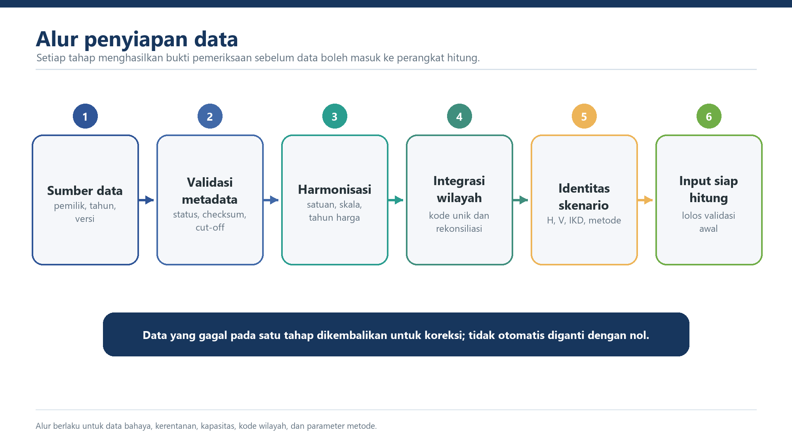

::: {.status-strip}
**Status:** draf kerja, belum normatif &nbsp;·&nbsp; **Acuan:** laporan 2026, workbook, dan register isu &nbsp;·&nbsp; **Versi:** 0.8
:::

## Tujuan Bab

Menetapkan data minimum, format, metadata, unit analisis, validasi, dan ketertelusuran input.

## 3.1 Unit Analisis

Unit dasar perhitungan adalah kabupaten/kota. Setiap rekaman wajib memiliki satu kode wilayah nasional yang unik. Agregasi provinsi dan nasional hanya dilakukan setelah seluruh kabupaten/kota lolos pemeriksaan cakupan, kode wilayah, dan kelengkapan.

## 3.2 Komponen Data

| Komponen | Isi minimum | Satuan/Skala |
|---|---|---|
| Bahaya | Indeks bahaya tunggal per jenis bahaya | 0-1 |
| Penduduk terpapar | Jumlah penduduk terpapar per bahaya | jiwa |
| Kerugian fisik | Nilai kerugian fisik per bahaya | Rp miliar dan tahun harga yang ditetapkan |
| Kerugian ekonomi | Nilai kerugian ekonomi per bahaya | Rp miliar dan tahun harga yang ditetapkan |
| Kerusakan lingkungan | Luas kerusakan per bahaya | hektare |
| Kapasitas | IKD kabupaten/kota | 0-1 |

## 3.3 Identitas Waktu dan Skenario

Workbook memuat dua skenario. Skenario `V2021` memakai bahaya dan kerentanan versi 2021 dengan kapasitas 2025. Skenario `V2025` mempertahankan bahaya 2021 dan kapasitas 2025 serta mengganti kerentanan menjadi versi 2025. Karena itu, perbandingan kedua sheet adalah perbandingan versi kerentanan dengan bahaya dan kapasitas tetap, bukan seri waktu IRBI 2021-2025.

Setiap keluaran wajib mencantumkan tahun atau versi H, V, IKD, parameter, kode wilayah, dan metode. Label tahun tunggal tidak boleh digunakan jika komponen berasal dari tahun yang berbeda.

## 3.4 Sumber Data Resmi

Daftar sumber resmi, produsen data, tanggal cut-off, versi, dan status pengesahan ditetapkan oleh penyelenggara nasional. Naskah ini tidak menetapkan bahwa seluruh data yang ada dalam workbook telah berstatus resmi. Data di luar daftar yang disahkan tidak digunakan tanpa prosedur persetujuan dan pencatatan perubahan.

## 3.5 Konsistensi Satuan

Nilai input harus dikonversi ke satuan baku sebelum transformasi fuzzy. Telaah workbook menunjukkan perbedaan skala yang material antara versi data: median rasio V2025 terhadap HV2021 sekitar 1.283 kali untuk kerugian fisik, 1.480 kali untuk kerugian ekonomi, dan 0,018 kali untuk kerusakan lingkungan. Perbedaan tersebut harus dijelaskan melalui metadata sumber, metode estimasi, tahun harga, resolusi spasial, dan prosedur agregasi.

Data tidak boleh diterima hanya karena menghasilkan formula tanpa galat. Nilai yang jauh melampaui ambang transformasi harus diperiksa karena dapat membuat indeks jenuh di sekitar 1 dan menghilangkan daya beda antarwilayah.

## 3.6 Kode Wilayah dan Penggabungan Data

Seluruh penggabungan menggunakan kode wilayah unik, bukan posisi baris. Sebelum perhitungan, sistem memeriksa keunikan kunci, kecocokan tahun kode, kelengkapan 514 wilayah atau cakupan resmi terbaru, perubahan nama, pemekaran, penggabungan, dan wilayah yang tidak memiliki pasangan data.

Referensi baris langsung seperti `RAW_V2025!H3` tidak digunakan dalam template nasional karena penyortiran satu sheet dapat memasangkan data dengan wilayah yang salah tanpa menghasilkan pesan galat.

## 3.7 Status Kelengkapan Data

Setiap nilai mempunyai satu status: **tersedia**, **nol sah**, **tidak berlaku**, **tidak tersedia**, atau **gagal validasi**. Status tersebut tidak boleh saling dipertukarkan. Nilai kosong tidak otomatis diubah menjadi nol dan `IFERROR` tidak digunakan untuk menyembunyikan kegagalan yang tidak dipahami.

## 3.8 Validasi Input

Validasi minimum meliputi tipe data, satuan, domain, nilai negatif, duplikasi, kode wilayah, kelengkapan bahaya, outlier, metadata, dan kesesuaian tahun. IKD harus berada pada rentang 0-1. Setiap koreksi dicatat bersama nilai awal, alasan, pelaksana, tanggal, dan persetujuannya.

## 3.9 Pemutakhiran dan Versi

Bahaya, kerentanan, dan kapasitas dapat memiliki siklus pembaruan berbeda. Setiap rilis harus membedakan perubahan kondisi, perubahan sumber data, perubahan parameter, perubahan metode, dan perubahan batas administrasi. Restatement seri sebelumnya hanya dilakukan berdasarkan prosedur yang ditetapkan dan diumumkan.
