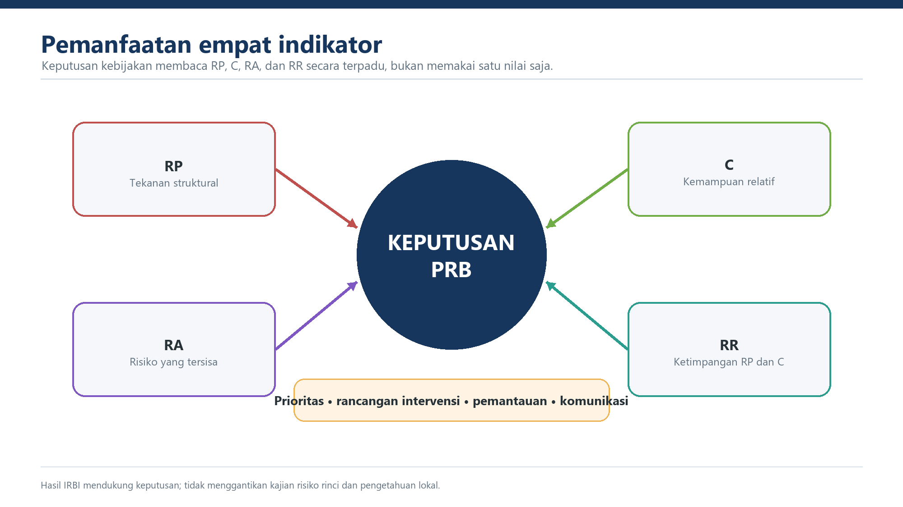

::: {.status-strip}
**Status:** draf kerja, belum normatif &nbsp;·&nbsp; **Acuan:** laporan 2026, workbook, dan register isu &nbsp;·&nbsp; **Versi:** 0.8
:::

## Tujuan Bab

Menghubungkan keluaran IRBI dengan perencanaan, prioritas PRB, evaluasi, dan intervensi tanpa melampaui makna indikator.

## 6.1 Penggunaan Bersama Empat Indikator

RP digunakan untuk membaca tekanan struktural; C untuk membaca kemampuan relatif daerah; RA untuk membaca risiko setelah kapasitas; dan RR untuk membaca ketimpangan RP-C. Keputusan kebijakan menggunakan keempatnya bersama komponen pembentuk dan konteks wilayah.

## 6.2 Perencanaan dan Prioritas PRB

Wilayah dengan RA tinggi dan RR tinggi atau kritis menjadi kandidat pendalaman prioritas, bukan otomatis penerima peringkat program. Analisis dilanjutkan ke jenis bahaya, komponen kerentanan, indikator kapasitas, kelompok terdampak, dan kelayakan intervensi.

## 6.3 Evaluasi Kinerja

Perubahan RA atau RR tidak langsung diatribusikan pada kinerja pemerintah daerah. Evaluasi harus memisahkan perubahan IKD dari pembaruan data bahaya, kerentanan, parameter, metode, satuan, dan kode wilayah. Skenario workbook V2021 dan V2025 tidak digunakan sebagai bukti tren kinerja tahunan.

## 6.4 Tingkat Pemanfaatan

Pada tingkat nasional, hasil mendukung analisis kesenjangan dan prioritas lintas wilayah. Pada tingkat provinsi, hasil mendukung koordinasi serta pendalaman kabupaten/kota. Pada tingkat kabupaten/kota, hasil mendukung analisis situasi, penelusuran komponen dominan, dan penyusunan usulan tindak lanjut. Pembagian kewenangan final ditetapkan pada Bab VII.

## 6.5 Batasan

Hasil tidak digunakan untuk menyimpulkan sebab tunggal, menggantikan KRB rinci, atau menetapkan sanksi dan insentif tanpa dasar kebijakan tambahan. Setiap penggunaan menyebut versi, keterbatasan, dan status resmi indikator.
