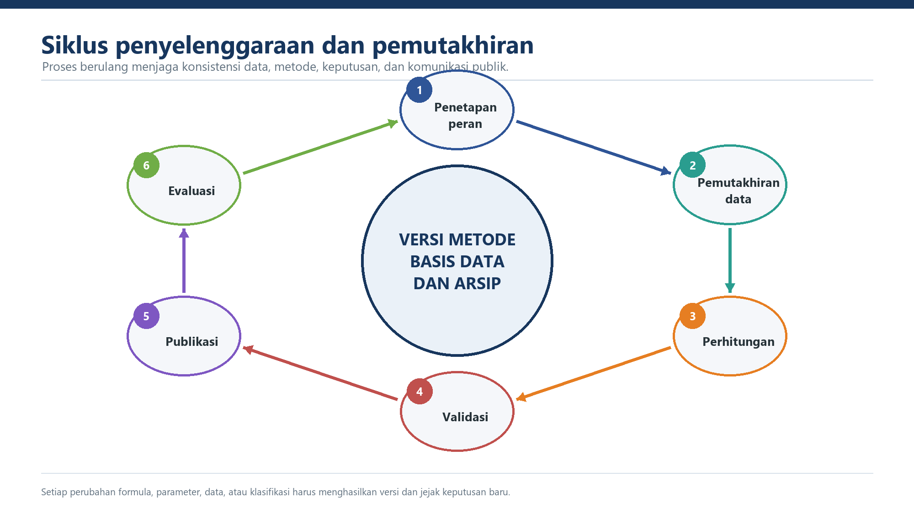

::: {.status-strip}
**Status:** draf kerja, belum normatif &nbsp;·&nbsp; **Fokus:** tata kelola siklus, versi, publikasi, dan transisi
:::

## Tujuan Bab

Menetapkan siklus penyelenggaraan, pengelolaan versi, pembaruan data, dokumentasi, publikasi, dan prasyarat pilihan transisi menuju penerapan nasional.

{#fig-siklus-penyelenggaraan fig-alt="Siklus penyelenggaraan dan pemutakhiran IRBI" .figure-panel}

## 7.1 Siklus Penyelenggaraan

Satu siklus terdiri atas: penetapan spesifikasi; penerimaan dan verifikasi data; penguncian versi data dan metode; perhitungan; QA/QC independen; validasi; persetujuan; publikasi; koreksi; dan evaluasi. Setiap tahap menghasilkan catatan waktu, penanggung jawab, versi masukan, keputusan, dan keluaran.

| Tahap | Keluaran minimum | Gerbang keputusan |
|---|---|---|
| Spesifikasi | unit analisis, periode, sumber, parameter, klasifikasi | disetujui pemilik metode |
| Data | berkas terkunci, metadata, checksum, rekonsiliasi kode | lolos gerbang input |
| Perhitungan | hasil antara dan keluaran per wilayah | hasil dapat direproduksi |
| Validasi | temuan, koreksi, berita acara | isu kritis tidak tersisa tanpa disposisi |
| Publikasi | tabel/peta, metadata, catatan metode, versi | disetujui pejabat berwenang |
| Evaluasi | masukan pengguna dan daftar perubahan | dasar siklus berikutnya |

## 7.2 Pembagian Peran

| Aktor | Peran yang perlu ditetapkan |
|---|---|
| BNPB/pemilik metode | menetapkan metode, sumber, versi, klasifikasi, QA/QC, dan rilis nasional |
| Tim teknis nasional | mengelola data, kode, perhitungan, pengujian, dokumentasi, dan reproduksi |
| Produsen data/KL | menjamin definisi, satuan, periode, metadata, dan koreksi sumber |
| BPBD provinsi | mengoordinasikan klarifikasi lintas kabupaten/kota dan konteks kewilayahan |
| BPBD kabupaten/kota | memeriksa identitas wilayah, menelaah kewajaran, dan memakai hasil yang disahkan |
| Validator/unit hukum | memeriksa formula, data, kewenangan, dan status dokumen sebelum penetapan |

Pembagian di atas merupakan rancangan fungsi. Nama unit dan kewenangan final harus mengikuti keputusan kelembagaan dan reviu hukum.

## 7.3 Pemutakhiran dan Pengelolaan Versi

Keluaran tidak diberi satu label tahun apabila H, V, dan IKD berasal dari periode berbeda. Identitas minimum versi adalah `H-versi`, `V-versi`, `IKD-versi`, `parameter-versi`, `metode-versi`, `kode-wilayah-versi`, dan tanggal cut-off. Perubahan satu unsur menghasilkan versi keluaran baru dan tidak menimpa arsip lama.

Data dinamis dapat ditinjau lebih sering, tetapi pembaruan hanya dipublikasikan setelah lulus prosedur yang sama. Koreksi pascarilis menyebut nilai sebelum/sesudah, alasan, wilayah terdampak, waktu, dan persetujuan.

## 7.4 Alternatif Transisi

| Alternatif | Posisi reformulasi | Prasyarat utama |
|---|---|---|
| Paralel | instrumen analitis pendamping | formula dapat diuji tanpa mengubah pelaporan resmi |
| Hibrida | indikator tertentu dipakai pada proses yang ditetapkan | ruang penggunaan, otoritas, dan hubungan dengan IRBI eksisting jelas |
| Penuh | menjadi standar nasional | isu kritis selesai; data, sistem, SDM, regulasi, dan komunikasi siap |

Alternatif ini adalah **opsi kebijakan**, bukan tahapan otomatis. Otoritas yang berwenang menetapkan pilihan, ruang berlaku, masa uji, kriteria evaluasi, dan keputusan lanjutannya.

## 7.5 Penyetaraan Skala

Persamaan 11 dikoreksi menjadi:

$$f(x)=y_{min}+(x-x_{min})\left(\frac{y_{max}-y_{min}}{x_{max}-x_{min}}\right)$$

Koreksi pembilang `y_max-y_min` menutup M-01. Penyetaraan belum dapat dijalankan sebagai prosedur normatif karena arah variabel dan nilai `x_max` kelas tinggi masih harus ditetapkan melalui [M-09](register-isu.qmd#m-09).

Jika kelak disahkan, nilai hasil penyetaraan harus diberi label **nilai transisi**, disimpan bersama nilai asli kedua metode, serta dilengkapi versi rumus, parameter, dan kelas.

## 7.6 Kesiapan Implementasi Penuh

Implementasi penuh mensyaratkan penyelesaian seluruh isu kritis, kamus data dan satuan yang disahkan, penggabungan berbasis kunci wilayah, satu sumber induk kapasitas, perangkat hitung teruji, QA/QC independen, struktur kelembagaan, dasar hukum, mekanisme koreksi, dan strategi komunikasi publik.
