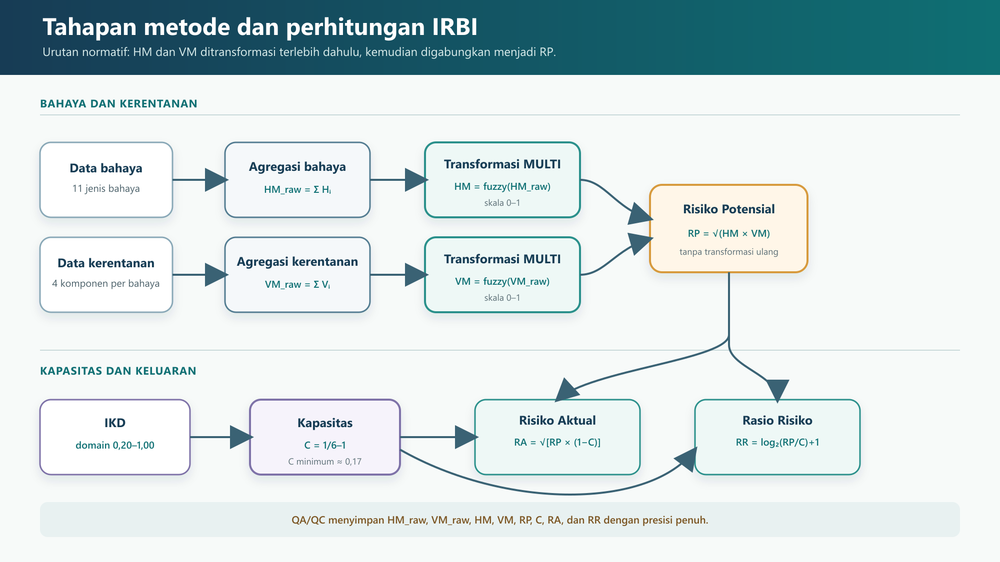

{#fig-lampiran-alur fig-alt="Diagram alir metode perhitungan IRBI" .figure-panel}

## Alur Operasional

1. Validasi sumber, satuan, periode, kode wilayah, dan status data.
2. Hitung dan simpan indeks bahaya tunggal serta komponen kerentanan per bahaya.
3. Agregasikan H dan V sesuai daftar bahaya yang disahkan.
4. Transformasikan `HM_raw` dan `VM_raw` masing-masing menjadi HM dan VM dengan parameter MULTI, lalu hitung `RP=sqrt(HM*VM)` tanpa transformasi ulang.
5. Transformasikan satu sumber IKD menjadi C.
6. Tolak IKD di luar 0,20-1,00; domain ini menghasilkan C minimum 1/6 sehingga `C=0` tidak mungkin.
7. Simpan hasil antara, jalankan QA/QC, validasi, persetujuan, dan publikasi.

::: {.callout-note}
Urutan transformasi di atas merupakan keputusan normatif M-05. Domain IKD dan C minimum merupakan keputusan M-06.
:::
