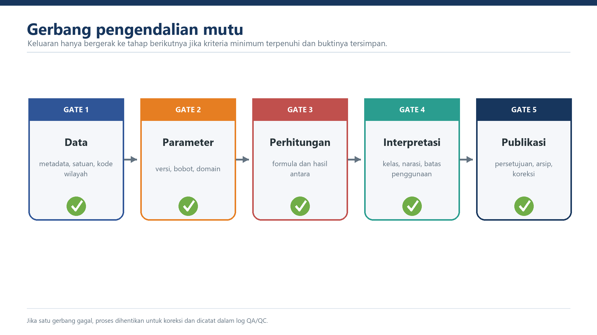

## Checklist Minimum

- [ ] Pemilik, periode, versi, satuan, tahun harga, cut-off, dan checksum setiap sumber tersedia.
- [ ] Kode wilayah unik dan seluruh join telah direkonsiliasi.
- [ ] Nol sah, tidak berlaku, tidak tersedia, dan gagal validasi dibedakan.
- [ ] Tidak ada nilai negatif atau IKD di luar 0,20–1,00 yang lolos ke perhitungan.
- [ ] Distribusi input dan tingkat saturasi transformasi telah ditelaah.
- [ ] Parameter dan bobot cocok dengan tabel induk versi yang digunakan.
- [ ] `HM_raw`, `VM_raw`, HM, VM, RP, C, RA, dan RR tersimpan.
- [ ] C minimum sama dengan 1/6 dan tidak ada keluaran sah dengan `C=0`.
- [ ] Reproduksi independen cocok hingga toleransi numerik yang ditetapkan.
- [ ] Kelas dihitung dari presisi penuh; pembulatan hanya untuk penyajian.
- [ ] Isu kritis tidak tersisa tanpa disposisi tertulis.
- [ ] Rilis memuat metadata, status validasi, versi, dan catatan perubahan.

{fig-alt="Gerbang pengendalian mutu IRBI" .figure-panel}

## Berita Acara Validasi

Berita acara sekurang-kurangnya memuat identitas siklus, daftar masukan, versi metode, pemeriksaan yang dilakukan, temuan, koreksi, dampak, isu tersisa, keputusan, nama/peran validator, waktu, dan persetujuan.
